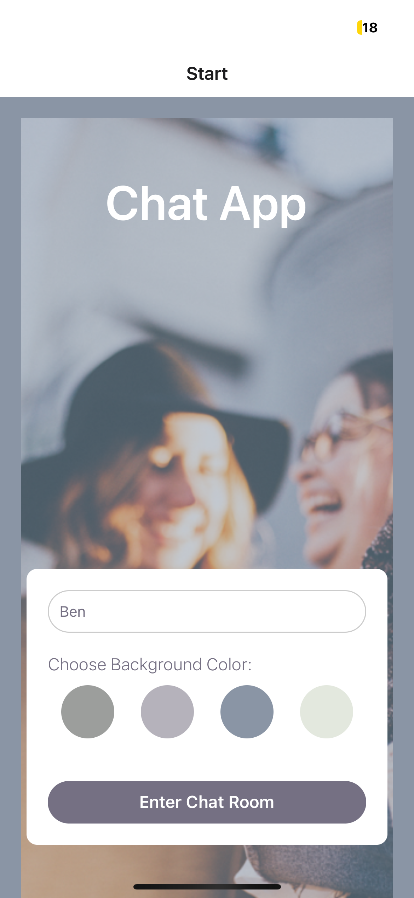

# Chat App

## Introduction

This goal of this achievement was to create a chat app for mobile using React Native. This app provides users the ability to chat, take and share images, as well as their location. 

## Screenshots

## Project Tasks

- Set up the React Native project using Expo.
- Test the app's appearance and functionality in various environments using the Android emulator (Android Studio).
- Create a chat user interface using the Gifted Chat React Native library.
- Implement real-time Firestore database functionality in the React Native app.
- Use NetInfo to detect network connection status (online or offline).
- Utilize AsyncStorage for client-side data storage.
- Implement communication features such as sending images and location data using Expo ImagePicker and Expo Location.

### Development mode

Start Expo with `npm start` or `expo start` terminal command.
